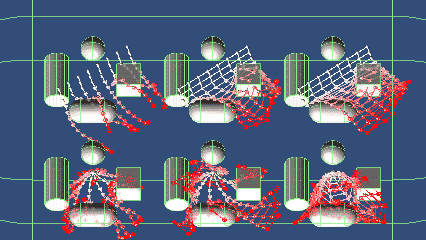

# EZSoftBone

This package is totally **FREE** and open-source.  
If you feel it helpful, you can buy it on [AssetStore](https://assetstore.unity.com/packages/slug/148136) to support me. Other than that, [Donations](https://github.com/EZhex1991/Receipts) are always welcome.

EZSoftBone is a simple kinetic simulator for Unity, you can use it to simulate hair/tail/breast/skirt and other soft objects.

[View it on GitHub](https://github.com/EZhex1991/EZSoftBone)  
[查看中文介绍](README_CN.md)  

- All colliders supported (include MeshCollider)
- Net structure supported (Cloth simulation)
- Use EZSoftBoneMaterial to adjust effects, and reuse it on other EZSoftBones
- Inherit EZSoftBoneColliderBase to create custom colliders

## EZSoftBone

- Root Bones: a list of root bone Transforms
- Structure
  - Start Depth: the start depth of the dynamic bones, depth below this value will be static
  - Sibling Constraints: add constrains on the nodes that have the same depth
    - None: no sibling constraints
    - Root: use sibling constraints for each Root Bone separately
    - Depth: use sibling constraints for the Root Bone list
  - ClosedSiblings: check this to add sibling constraints as a circle
- Performance
  - Iterations: how many times should the Nodes to be calculated in one frame
  - Material: `EZSoftBoneMaterial`, default material will be used if not specified
  - Sleep Threshold: speed below this threshold will go to sleep (useful for high frame rate)
- Collidsion
  - Collision Layers: which layers the bones collide with
  - Extra Colliders: extra colliders (normal colliders required, this is for compatible purpose)
  - Radius: collider size for Nodes
  - Radius Curve: how should the size distribute on the bones
- Force
  - Gravity: gravity
  - Force Module: `EZSoftBoneForce`, wind simulation
- References
  - Gravity Aligner: A transform can be specified to determine how much the gravity effects the system, inversely correlated to dot product of aligner's y direction and world's y direction  
    - *eg: Create a new GameObject, leave its rotation unchanged (identical to the world space), drag it down to the head of a character, and set it as the aligner of the Hair system. You will see the grivity has no effect on the hair when the character stands still, and has maximum effect when the character lies down or bows*
    - To create a context menu to reset Transform's world rotation easily, Check this page: [EZTransformContextMenu](https://github.com/EZhex1991/EZUnity/blob/master/Assets/EZhex1991/EZUnity/Editor/ContextMenu/EZTransformContextMenu.cs)
  - Simulate Space: A transform can be specified as a simulate space, it's useful when the system needs to be updated with a moving object (relatively static)  
    - *eg: a character in a moving car, hair should be relatively static to the car*

## EZSoftBoneMaterial

- Damping: speed attenuation
- Stiffness: shape retention
- Resistance: force resistence
- Slackness: length retention

Each value has a corresponding curve represent the value distribution on the bone hierarchy

## EZSoftBoneForce

- Use Local Direction: check it to use local space direction
- Direction: base force vector
- Turbulence: force turbulence vector
- Conductivity: (wind speed)
- Turbulence Mode:
  - Curve:
    - Turbulence Time Cycle: turbulence time cycle
    - Turbulence Curve: turbulence variation curves for each axis
  - Perlin:
    - Turbulence Speed: x coordinate speed for 2d perlin noise
    - Random seed: y coordinate position for 2d perlin noise
