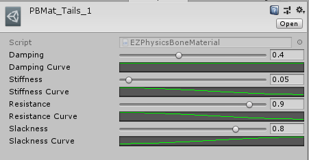
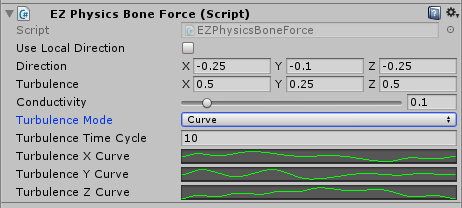
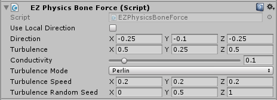

# EZPhysicsBone

[View it on GitHub](https://github.com/EZhex1991/EZPhysicsBone)  
[查看中文介绍](README_CN.md)  

- All colliders supported (include MeshCollider)
- Net structure supported (Cloth simulation)
- Use EZPhysicsBoneMaterial to adjust effects, and reuse it on other EZPhysicsBones
- Inherit EZPhysicsBoneColliderBase to create custom colliders

## EZPhysicsBone

- Root Bones: a list of root bone Transforms
- Structure
  - Start Depth: the start depth of the dynamic bones, depth below this value will be static
  - End Node Length: use this to create a additional node, it will makes the end of the mesh looks more natural
  - Sibling Constraints: add constrains on the nodes that have the same depth
    - None: no sibling constraints
    - Root: use sibling constraints for each Root Bone separately
    - Depth: use sibling constraints for the Root Bone list
  - ClosedSiblings: check this to add sibling constraints as a circle
- Performance
  - Iterations: how many times should the Nodes to be calculated in one frame
  - Material: `EZPhysicsBoneMaterial`, default material will be used if not specified
  - Sleep Threshold: speed below this threshold will go to sleep
- Collidsion
  - Collision Layers: which layers the bones collide with
  - Extra Colliders: extra colliders (normal colliders required, this is for compatible purpose)
  - Radius: collider size for Nodes
  - Radius Curve: how should the size distribute on the bones
- Force
  - Gravity: gravity
  - Force Module: `EZPhysicsBoneForce`, wind simulation

## EZPhysicsBoneMaterial

- Damping: speed attenuation
- Stiffness: shape retention
- Resistance: force resistence
- Slackness: length retention

Each value has a corresponding curve represent the value distribution on the bone hierarchy

## EZPhysicsBoneForce

- Use Local Direction: check it to use local space direction
- Direction: base force vector
- Turbulence: force turbulence vector
- Conductivity: (wind speed)
- Turbulence Mode:
  - Curve:
    - Turbulence Time Cycle: turbulence time cycle
    - Turbulence Curve: turbulence variation curves for each axis
  - Perlin:
    - Turbulence Speed: x coordinate speed for 2d perlin noise
    - Random seed: y coordinate position for 2d perlin noise
